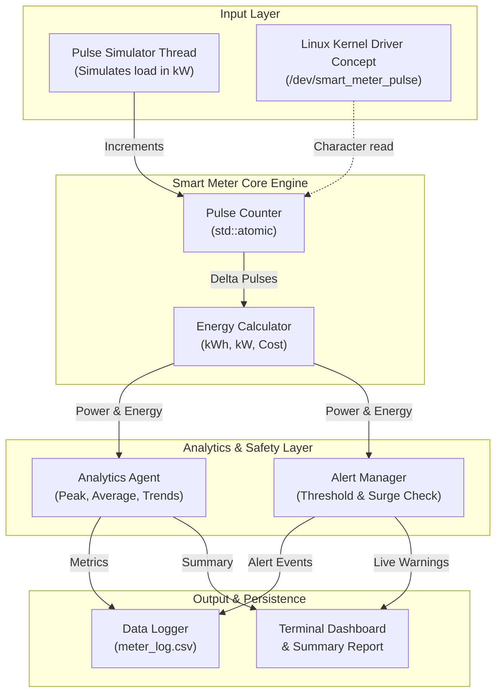
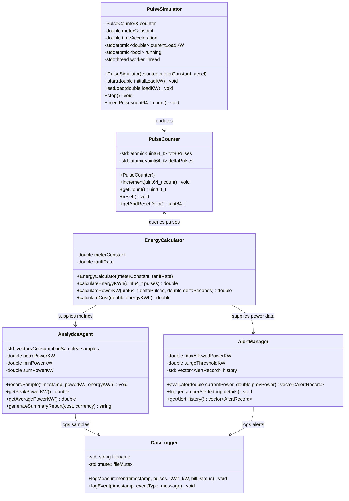
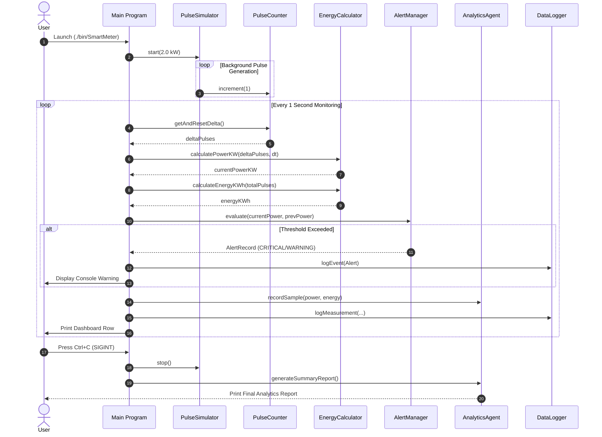
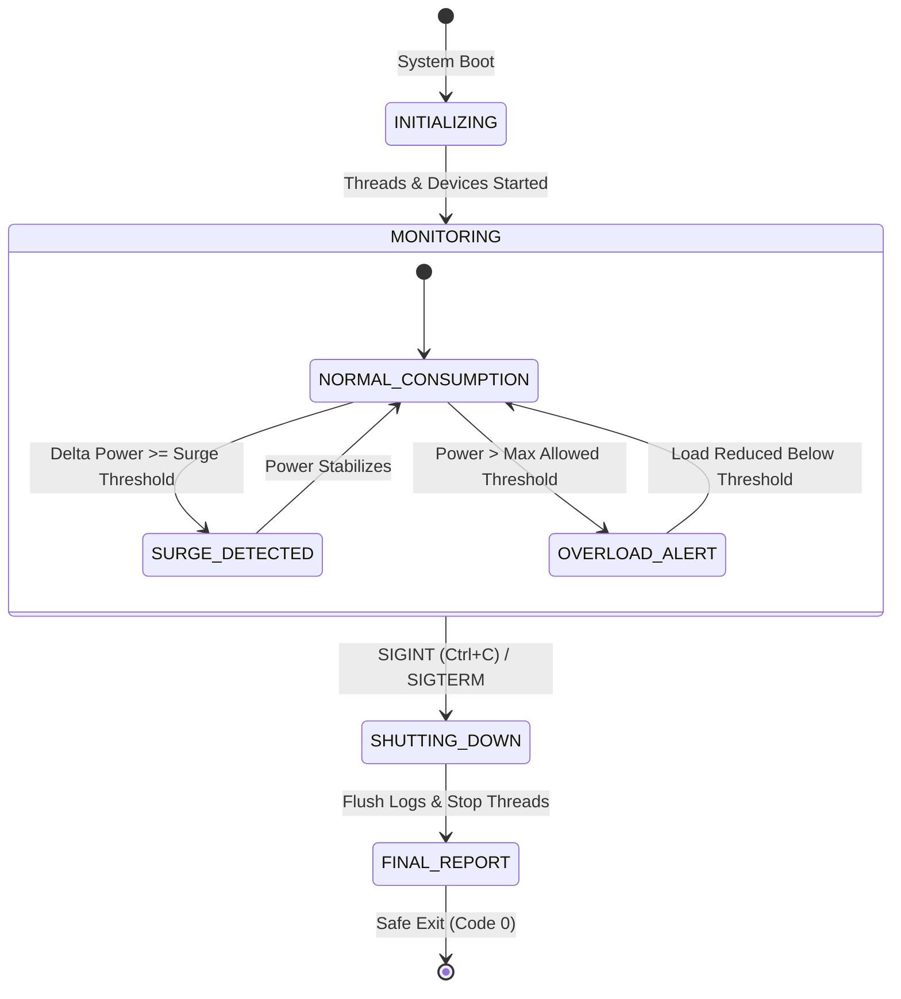

# Smart Energy Smart Meter – Pulse Counter & Analytics Agents

[]()
[]()
[]()
[]()

A Linux-based smart energy meter simulation and real-time energy analytics system developed in modern C++ (C++17). The project integrates multi-threading, POSIX signal handling, real-time pulse processing, energy consumption calculations, automated alert management, and analytics reporting.

---

## 📋 Table of Contents
1. [Project Overview & Problem Statement](#project-overview--problem-statement)
2. [Objectives & Scope](#objectives--scope)
3. [Key Features](#key-features)
4. [System Architecture](#system-architecture)
5. [UML Diagrams](#uml-diagrams)
   - [Class Diagram](#class-diagram)
   - [Sequence Diagram](#sequence-diagram)
   - [State Machine Diagram](#state-machine-diagram)
6. [Linux System Programming Concepts](#linux-system-programming-concepts)
7. [Directory Structure](#directory-structure)
8. [Build and Execution Guide](#build-and-execution-guide)
9. [Test Suite & Verification](#test-suite--verification)
10. [Deliverables Checklist](#deliverables-checklist)

---

## ⚡ Project Overview & Problem Statement

### Problem Statement
Traditional energy meters require manual meter readings, lack real-time visibility into instantaneous power surges, provide no immediate warning mechanisms during dangerous overload conditions, and cannot detect anomalies or power tampering at the edge.

### Solution
This project implements a software-defined **Smart Energy Smart Meter** running on Linux that:
1. Simulates and counts optical high-frequency pulses from an electric meter LED (e.g., $1000\text{ imp/kWh}$).
2. Calculates instantaneous active power ($\text{kW}$), cumulative energy ($\text{kWh}$), and real-time utility bills.
3. Evaluates power thresholds using an **Alert Manager** to flag overload surges and tampering.
4. Executes continuous statistical tracking through an **Analytics Agent** (peak load, average load, anomaly timestamps).
5. Persists time-stamped metrics to a persistent CSV log (`meter_log.csv`).
6. Uses Linux system programming (multi-threading, POSIX signals for graceful teardown, and character device concepts).

---

## 🎯 Objectives & Scope

- **Real-Time Pulse Acquisition:** Capture hardware-generated or simulated pulses concurrently without losing count using thread-safe primitives.
- **Accurate Energy Metering:** Convert raw pulses to kilowatt-hours ($\text{kWh}$) and active power ($\text{kW}$) using configurable meter constants.
- **Edge Analytics & Safety Alerts:** Detect and warn about over-consumption ($>5.0\text{ kW}$) or sudden surges within seconds.
- **Robust Linux Architecture:** Clean multi-threaded architecture with POSIX signal handlers (`SIGINT`, `SIGTERM`) for safe shutdown and log flushing.

---

## 🛠️ Key Features

- **Thread-Safe Pulse Counter:** Lockless atomic counter (`std::atomic<uint64_t>`) with delta tracking for high-frequency pulse inputs.
- **Configurable Pulse Simulator:** Simulates real-world household and industrial loads with speedup acceleration for rapid demonstration.
- **Energy & Billing Calculator:** Real-time computation of power, energy consumption, and tiered billing costs.
- **Real-time Alert Manager:** Threshold monitoring detecting overload conditions and abnormal load jumps.
- **Analytics Agent:** Computes minimum, maximum/peak, and session averages, generating structured summary reports.
- **Structured File Logger:** Appends formatted CSV metrics and event logs with microsecond/second precision.
- **Linux Character Device Driver Concept:** Includes `driver/pulse_driver.c` demonstrating kernel-to-userspace character device architecture (`/dev/smart_meter_pulse`).

---

## 🏗️ System Architecture



---

## 📊 UML Diagrams

### Class Diagram


### Sequence Diagram


### State Machine Diagram


---

## 🐧 Linux System Programming Concepts

1. **Multithreading (`std::thread`, `pthreads`):** Concurrent producer-consumer pattern. The simulation thread generates pulses asynchronously while the main thread performs periodic calculations and logging.
2. **POSIX Signals (`signal(SIGINT)`, `signal(SIGTERM)`):** Safe signal interception ensures file handles are flushed and background threads are joined before process exit.
3. **Atomic Operations (`std::atomic`):** Lockless, atomic pulse accumulation avoiding race conditions across threads.
4. **Linux Character Device Driver Concept (`driver/pulse_driver.c`):** Demonstrates registering `/dev/smart_meter_pulse` using `alloc_chrdev_region`, `cdev_add`, and standard `file_operations` (`open`, `read`, `write`, `release`).

---

## 📁 Directory Structure

```text
SmartMeterProject/
├── .gitignore               # Ignores build/, bin/, logs
├── CMakeLists.txt           # Modern CMake configuration (builds app & tests)
├── README.md                # Comprehensive documentation and UML
├── bin/                     # Generated executables (SmartMeter, TestSmartMeter)
├── build/                   # CMake build directory
├── driver/                  # Linux Kernel Device Driver concept
│   ├── Kbuild               # Kernel build descriptor
│   ├── Makefile             # Kernel module compilation Makefile
│   └── pulse_driver.c       # Character device driver implementation
├── include/                 # Header files
│   ├── AlertManager.h
│   ├── Analytics.h
│   ├── DataLogger.h
│   ├── EnergyCalculator.h
│   ├── PulseCounter.h
│   └── PulseSimulator.h
├── src/                     # C++ Source implementations
│   ├── AlertManager.cpp
│   ├── Analytics.cpp
│   ├── DataLogger.cpp
│   ├── EnergyCalculator.cpp
│   ├── PulseCounter.cpp
│   ├── PulseSimulator.cpp
│   └── main.cpp
└── tests/                   # Automated Unit Tests
    └── test_meter.cpp
```

---

## 🚀 Build and Execution Guide

### Prerequisites
- GCC / G++ (v8.0+ supporting C++17)
- CMake (v3.10+)
- Linux (Ubuntu/Debian) or WSL 2 (Windows Subsystem for Linux)
- Make

### 1. Build the Project
In your Linux / WSL terminal:
```bash
# Configure build with CMake
cmake -B build

# Compile all executables
cmake --build build
```

### 2. Run the Main Smart Meter
To run the interactive continuous monitoring (press `Ctrl+C` to stop):
```bash
./bin/SmartMeter
```

To run the automated **15-cycle demo mode** (includes load surge & overload events):
```bash
./bin/SmartMeter --demo
```

### 3. Inspect Logged Data
Review real-time CSV logged measurements:
```bash
cat meter_log.csv
```

---

## 🧪 Test Suite & Verification

Run the automated test runner:
```bash
./bin/TestSmartMeter
```

### Output:
```text
=====================================
   SMART METER SUITE: UNIT TESTS     
=====================================
[TEST] Running PulseCounter tests... PASSED!
[TEST] Running EnergyCalculator tests... PASSED!
[TEST] Running AlertManager tests... PASSED!
[TEST] Running AnalyticsAgent tests... PASSED!

All 4 Test Suites Passed Successfully! (100% OK)
```

---

## ✅ Deliverables Checklist (Stages 1 – 6)

- [x] **Working C++ Project:** Clean C++17 modular architecture.
- [x] **Linux Implementation:** Runs natively on Linux and WSL.
- [x] **g++ Compilation:** Successfully builds via CMake + g++.
- [x] **Pulse Simulator:** Simulates real-time electrical pulses with configurable power levels.
- [x] **Pulse Counter:** Thread-safe atomic counter with delta acquisition.
- [x] **Energy Calculator:** Computes active power ($\text{kW}$), energy ($\text{kWh}$), and tariffs.
- [x] **Data Logger:** Persists formatted CSV logs and event histories.
- [x] **Analytics Agent:** Computes peak power, average consumption, and analytical summary.
- [x] **Alert System:** Detects overloads, surges, and alerts.
- [x] **Linux System Programming:** Multithreading, POSIX signals, atomic memory ordering, and character driver concept.
- [x] **UML Diagrams:** Class, Sequence, and State Machine diagrams included.
- [x] **Unit Tests:** Comprehensive automated test suite passing 100%.
- [x] **Clean GitHub Repository:** Configured `.gitignore` and clean tree.
